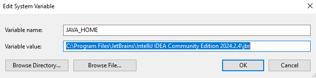
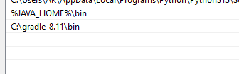
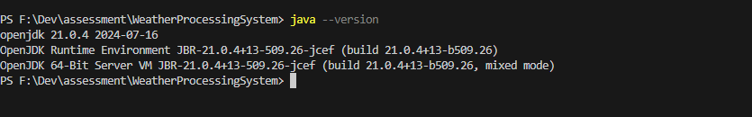
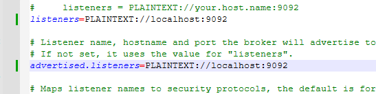

# Assessment Weather Processing System

## Explain

This project is a comprehensive weather data processing system that handles real-time storm data. The system consists of three main services: a Data Collection Service, a Golang ETL Service, and a Node.js service that exposes the processed data through an API.


## Overview

The system processes storm data from NOAA and provides an API to query the data. It consists of:

1. **Data Collection Service (Python)**: Fetches storm reports from NOAA or a local file and publishes them to a Kafka topic.
2. **Golang ETL Service**: Consumes raw storm data from Kafka, performs ETL operations, and publishes transformed data to another Kafka topic.
3. **Node.js API Service**: Consumes transformed data from Kafka, stores it in MongoDB, and provides an API to query the data.

## Architecture

1. **Data Collection Service**:
   - Fetches data from NOAA or uses a local CSV file for testing.
   - Publishes data to the `raw-weather-reports` Kafka topic.

2. **Golang ETL Service**:
   - Consumes messages from the `raw-weather-reports` topic.
   - Transforms the data and publishes it to the `transformed-weather-data` topic.

3. **Node.js API Service**:
   - Consumes messages from the `transformed-weather-data` topic.
   - Stores data in MongoDB and provides an API to query storm reports by date and location.

## Setup

### Prerequisites

- **Kafka**: Ensure Kafka is installed and running.
- **MongoDB**: Ensure MongoDB is installed and running.
- **Python**: Install Python 3.x and required packages.
- **Golang**: Install Go 1.x and required packages.
- **Node.js**: Install Node.js 14.x or later.


### Install environment

All terminals should be opened by gitbash (windows)
> install vscode

> install python

> install pip
```bash
python -m ensurepip --upgrade
```
or

Download https://bootstrap.pypa.io/get-pip.py
```bash
python get-pip.py
```

> install go

> install nvm

Install nvm from https://github.com/coreybutler/nvm-windows/releases

> install npm using nvm

```bash
npm install 21
npm ls
npm use 21
```

> install kafka

Install IntelliJ IDEA Community version from https://www.jetbrains.com/idea/download/?section=windows

Setup JAVA_HOME and java path





Check java version
```bash
java --version
```


Download gradle from https://gradle.org/releases/ (binary only)

Unzip gradle.zip

Setup env gradle/bin path


Download kafka from https://kafka.apache.org/downloads (Binary download)
Unzip kafka.zip

change config file.

server.properties


```bash
cd C:/kafka_2.13-3.9.0
./bin/windows/zookeeper-server-start.bat ./config/zookeeper.properties
./bin/windows/kafka-server-start.bat ./config/server.properties
```

> Install MongoDB

Download and install from https://www.mongodb.com/try/download/community-kubernetes-operator

To verify mongodb data in GUI mode download mongodb compass from https://www.mongodb.com/try/download/compass

# Project configuration

### Config kafka

Create Kafka topic
```bash
./bin/windows/kafka-topics.bat --create --topic raw-weather-reports --bootstrap-server localhost:9092 --partitions 1 --replication-factor 1
./bin/windows/kafka-topics.bat --create --topic transformed-weather-data --bootstrap-server localhost:9092 --partitions 1 --replication-factor 1
```

Verify the topic creation
```bash
./bin/windows/kafka-topics.bat --list --bootstrap-server localhost:9092
```
Reset consumer group
```bash
./bin/windows/kafka-consumer-groups.bat --bootstrap-server localhost:9092 --group weather-etl-group --describe
```

Python Data collection service

```bash
cd weather-collection-service
pip install -r requirements.txt
```

Go ETL service

```bash
cd weather-etl-service
npm mod tidy
```

Node API service

```bash
cd weather-report-service
npm install
```

# Run Project

Verify running kafa topics. `raw-weather-reports` and `transformed-weather-data`

Verify running mongodb on 27017 port of localhost

Python Data collection service

```bash
cd weather-collection-service
python app.py
```
The default service will be hosted on 5000 port
    
Get manually csv data using this api http://localhost:5000/start

> Toogle running using `USE_LOCAL_TEST` variable in app.py

Go ETL service

```bash
cd weather-etl-service
go run main.go
```

Node API service

> The service will be hosted on 3000 port

```bash
cd weather-report-service
npm start
```

We can verify all data using http://localhost:3000/api/reports

## Run all services using docker
```bash
docker-compose up --build
```

## Stop all
```bash
docker-compose down
```

## API Usage

The Node.js API service provides endpoints to query the storm data stored in MongoDB.

### Get Data manually From csv

- **Port**: `5000`
- **Endpoint**: `/start`
- **Method**: GET

### Example Request

```bash
curl "http://localhost:5000/start"
```

### Query Storm Reports

- **Port**: `3000`
- **Endpoint**: `/api/reports`
- **Method**: GET
- **Query Parameters**:
  - `date`: Optional. Filter reports by date. Supports partial matching.
  - `location`: Optional. Filter reports by location. Supports partial matching.

#### Example Request

```bash
curl "http://localhost:3000/api/reports?date=11/11/24&location=Rockaway Beach"